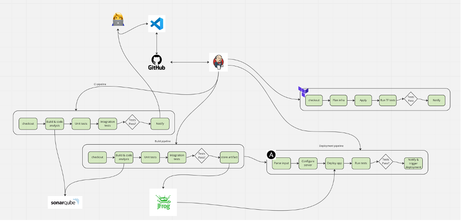

__Question 1__

___a.	Version control – GitHub___
-	GitHub is preferably the best to use as version control, but any distributed version control based on git is good fit. GitHub in general has better integrations to setup the automation and repo administration

___b.	Continuous integration tool – GitHub Actions / Jenkins___
-	GitHub Actions has the ready to use automation stages published as opensource definitions
-	GitHub workflows are simpler and can help avoid lot of time in configuring administrations like Pull request hooks etc when using CI tools like Jenkins
-	GitHub lacks the flexibility to define the custom workflows, but not impossible
-	Jenkins is a natural winner when it comes to custom pipeline definitions and keep the pipelines code DRY
-	Jenkins also has major open source integrations through plugins and can be easily configured
-	Jenkins pipeline as code helps to version the pipeline change as code
-	However, Jenkins administration is time consuming and costly
-	Jenkins administration also requires quite a bit of effort to automate as code and not all the plugin configurations support automation to treat everything as cod

___c.	Code analysis scanning – SonarQube___
-	SonarQube is great to perform code analysis and has support for major languages
-	SonarQube configuration is pretty simple and has developer friendly integrations in IDE
-	However, SonarQube has some useful features available only in paid version which is quite expensive
-	Due to that we can’t build custom dashboards as we like

___d.	Artifact storage – Jfrog/Nexus___
-	Both jfrog and Nexus are the best available artifact management tools
-	If the option is to go with cost effective choice, then Nexus is a win
-	Where as Jfrog has better automation APIs to support different use cases in CICD pipelines
-	Jfrog SaaS is quite expensive as well and requires some effort to define the policies and tenant

___e.	Configuration management – Ansible/Chef___
-	Ansible is a natural winner in configuration management due to it’s simplicity yet strong in providing modules to solving complex configuration management tasks
-	Easy to write custom modules and integrate
-	Works with dynamic inventory with just one simple init fine
-	On the other hand, Chef is complex is technology but has It’s own way to organize things in configuration management
-	Chef also requires administration work due to it’s client server model

___f.	Deployment solution – Ansible/Jenkins, for more advanced use cases like canary/blue-green we can also go with Spinnaker/Harness___
-	We can choose ansible as deployment tool to automate deployment steps as playbooks and can be made generic to re-use for multiple environments/project
-	Jenkins is also an option and provides same flexibility as ansible to write deployment pipeline but requires servers to be added / use creds to login to all the deployment servers and configure with Jenkins

___g.	IaC - Terraform/CloudFormation___ 
-	Without a doubt terraform is the choice for IaC as it has support for multi cloud and provides support for many modules to automate almost everything w.r.t infrastructure
-	Terraform can also scale for the custom requirements without need to do complex automation like cloud formation requires setup lambdas to support custom use cases

___h.	Testing integration___ (junit/selenium/postman packs)

___i.	Release management___ – more advanced for controlling and measuring release metrics of an application
 

 

__Question 2__

In-order to secure credentials, we’ve multiple ways and it depends on the strategic secret management tools. 

_For example:_

___Option #1:___

we can use AWS parameter store/secrets manager with restricted IAM permissions for people/teams need access based on ABAC.

Similarly, we can setup the pipeline scoped IAM policies and configure Jenkins agents in such a way that specific projects can only use the agents and agents have permission to do API call to AWS to fetch credentials.

___Option #2:___

we can setup Hashicorp vault and configure vault policies to scope the KV access in vault to specific people/team.

Vault can also be integrated with Jenkins and configure pipelines with project scoped vault tokens to let the project pipelines query vault and get credentials.

__Question 3__

•	First configure GitHub API in Jenkins backend configurations, manage Jenkins -> configure system -> GitHub -> Add GitHub Server. And test the connectivity

•	Pre-requirement for above step is to have secure token type credentials created to authenticate with GitHub API

•	Configure webhook in GitHub to ensure the event payload is sent to Jenkins, this can be done in GitHub settings -> webhook configurations. Ensure the payload delivery is tested to confirm webhook is able to send the payload to Jenkins

•	Create a new pipeline style job and configure GitHub project property with the GitHub repo link

•	Under build trigger, select GitHub hook trigger for GitScm polling to enable trigger on webhook event

•	Under pipeline, select Pipeline script from SCM repo, add the attached Jenkinsfile in GitHub and provide the path here

•	This will enable to start the pipeline upon commits. This can also be automated through jcasc through code

